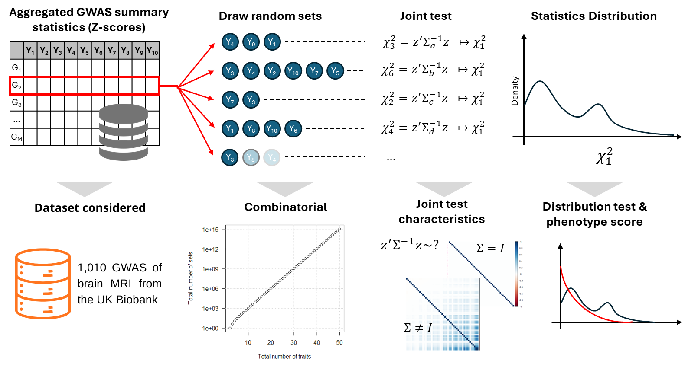
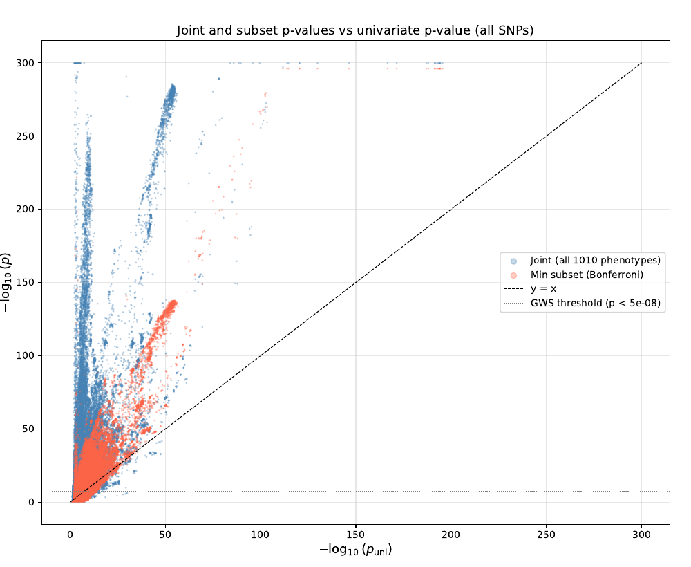
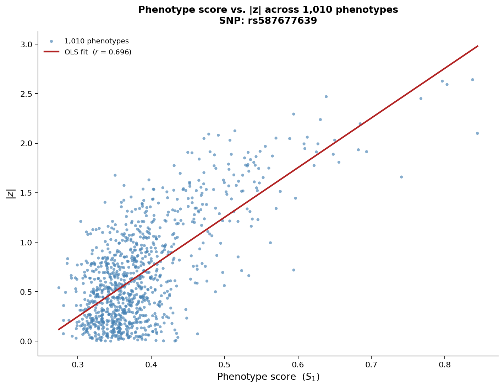
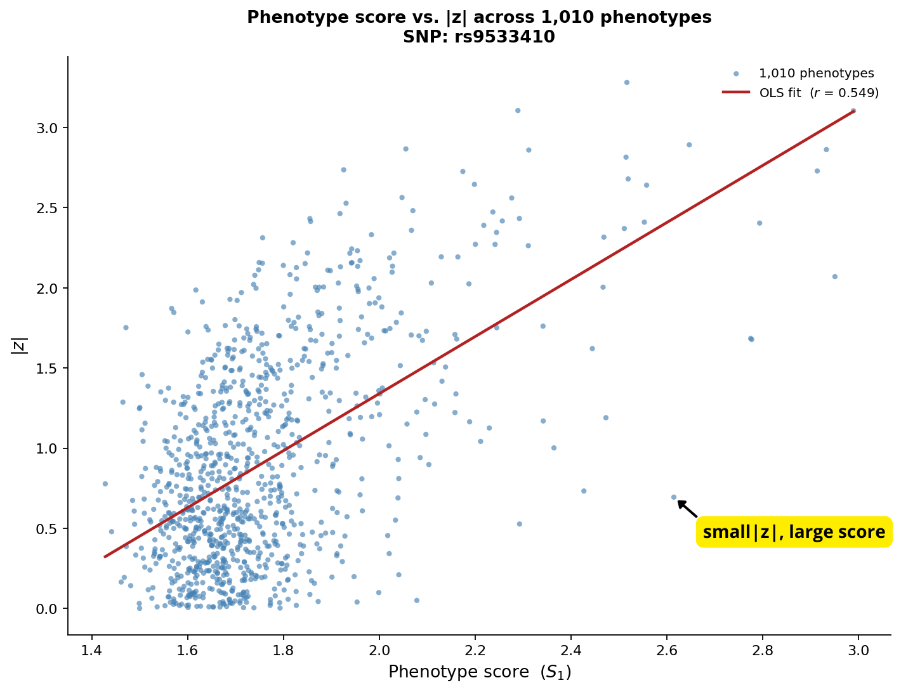
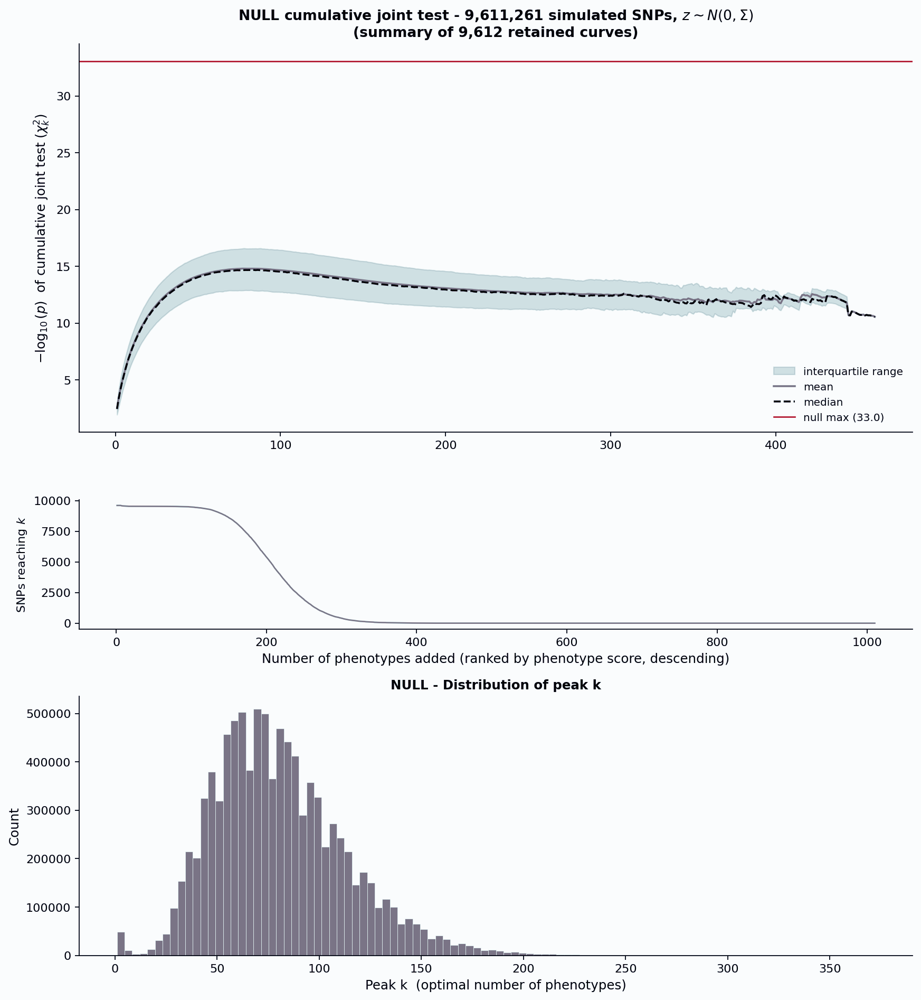
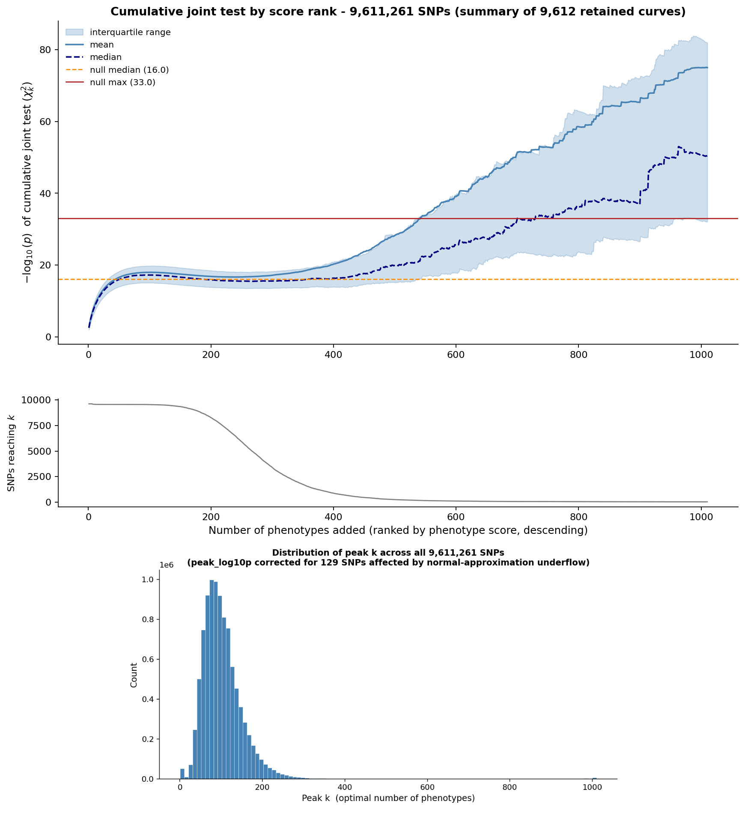
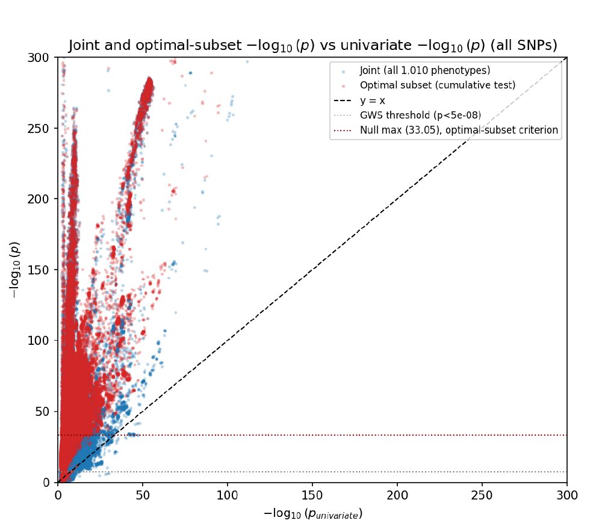

# Random Subset Sampling for Multitrait GWAS

This repository accompanies the article *Random Subset Sampling for Multitrait
GWAS: A Scalable Alternative to Exhaustive Phenotype Testing*
([`paper.pdf`](paper.pdf)), written during Christopher Won's internship at
Institut Pasteur. It contains the code for the full pipeline, applied to 1,010
brain MRI GWAS from the UK Biobank (9,611,261 SNPs).

For a detailed report covering the background, the staged scale-up from a pilot to the 
full-scale run, the downstream analysis and the mathematical derivations, see [`report.pdf`](report.pdf)

**Headline results** (full-scale run, all 1,010 phenotypes):

- **666 SNPs** are significant under subset-based testing alone, i.e. missed by
  the joint test over all phenotypes.
- **173,033 SNPs** have a cumulative joint signal that cannot be attributed to
  the ranking procedure itself; 99.69% of them are also joint-significant, and
  529 are genuine subset-specific discoveries.
- The two independently constructed approaches (random subsets, and
  score-ranked cumulative testing) cross-validate each other.

  

<em>Pipeline overview (Figure 1 of the paper): z-scores are
aggregated, random phenotype subsets are drawn and tested jointly against the
LDSC-derived null covariance, and the resulting statistics are rescaled onto a
common &chi;21 scale to give a per-phenotype score.</em>

## The idea in short

Genome wide association studies normally test one SNP against one phenotype at
a time. When phenotypes are correlated, a SNP with a moderate coordinated effect
across many of them can fail to reach significance in any single univariate
test, yet be strongly supported when those phenotypes are tested jointly.
Testing all phenotypes together reintroduces a different problem: a signal
carried by only a small group of related phenotypes gets diluted once every
phenotype is included. Exhaustively testing every phenotype subset is
combinatorially infeasible (roughly 10^304 subsets for 1,010 phenotypes).

The method implemented here instead:

1. **Samples** Ns = 10,000 random phenotype subsets and tests each jointly,
   using the LDSC intercept matrix as the null covariance.
2. **Rescales** every subset's statistic onto a common chi squared, 1 degree of
   freedom scale, so subsets of different sizes stay comparable.
3. **Scores** each phenotype by attributing each subset's joint signal back to
   individual phenotypes.
4. **Ranks and tests** phenotypes by that score with a cumulative joint test over
   nested prefixes of the ranking, calibrated against a null run of the same
   size, to find SNPs whose peak signal cannot be explained by the ranking
   procedure alone.

## Results

### Joint and subset-based tests vs. the univariate test

Across all SNPs, the joint test (blue) and the minimum-subset test (orange) are
almost always more significant than the best single phenotype (points above the
y = x line). The subset test is a noisier, sampling-based approximation of the
same idea, which suggests stronger signal exists in subsets not covered by the
current 10,000 draws.

  

<em>Figure 4 of the paper: &minus;log10(p) of the joint and
minimum-subset tests against the univariate &minus;log10(p), for every SNP.</em>

### What the phenotype score captures

The phenotype score tracks the marginal |z| closely for most SNPs (left,
r = 0.696). For some SNPs the relationship breaks down (right, r = 0.549):
phenotypes in the lower right have a large score despite a small |z|, a signal
that is invisible to univariate testing and that a joint test over all 1,010
phenotypes would dilute away.

  
  

<em>Figure 5 of the paper: phenotype score vs. |z| across all 1,010
phenotypes for <code>rs587677639</code> (left) and the discordant SNP
<code>rs9533410</code> (right).</em>

### Cumulative joint testing of score-ranked phenotypes

Phenotypes are ranked by score and tested in nested prefixes. The null run
(simulated SNPs, left) sets the calibrated significance threshold (null max
&asymp; 33.0); on the real data (right), the curves rise well above it, with
the peak occurring at a modest number of phenotypes rather than at the full set.

  
  

<em>Figure 6 of the paper: cumulative joint test of score-ranked
phenotypes for (left) 9,611,261 simulated null SNPs and (right) the 9,611,261
real SNPs. Top: &minus;log10(p) against the number of phenotypes included.
Middle: number of SNPs still running at each k. Bottom: distribution of the peak k.</em>

### Joint vs. optimal-subset test

The calibrated optimal-subset test (red) tracks slightly above the joint test
(blue) across most of the range, and both sit almost entirely above y = x.

  

<em>Figure 7 of the paper: joint and optimal-subset &minus;log10(p)
per SNP against the minimum univariate &minus;log10(p). Dotted lines mark the
calibrated optimal-subset threshold (33.05) and the genome-wide significance
threshold (5 &times; 10&minus;8).</em>

See [`paper.pdf`](paper.pdf) for the full methods, results and discussion.

## Where to start

The exact stages (sampling, score matrix, p values, LDSC intercept
derivation, cumulative joint testing) and the order to run them in are
documented in each folder's own README, not repeated here. Start with the
`READ_FIRST.md` (or `README_toy_example.md`, inside a toy folder) in whichever
folder you're working in.

The repository contains two sets of scripts, corresponding to two versions of
the input data: a z-score matrix with no missing entries
(`0%_sparsity_zscore_matrix/`) and one with missing entries
(`sparse_zscore_matrix/`).

**Only `0%_sparsity_zscore_matrix/` was used to produce the results and figures in
the article.** The sparse case is implemented and functional, but its results are
not reported in the article; within the 3-month internship there was time to run
the pipeline but not to write up a second set of results alongside the first.

## Repository layout

Two independent, parallel pipeline implementations, depending on whether your
z score matrix has missing entries:

- `sparse_zscore_matrix/`: for real data with missing z scores. Pairwise
  complete throughout. This is the more actively maintained implementation;
  see its `READ_FIRST.md` for the order to run things in, and its
  `script_descriptions.md` for a detailed walkthrough of what each script
  actually computes and how, phenotype by phenotype and stage by stage,
  beyond just the run order.
- `0% _sparsity_zscore_matrix/`: for data with no missing z scores. Simpler
  and faster since there is no missingness bookkeeping. Configuration
  validation and the fallback correction step's adaptive search now match
  the sparse pipeline throughout: every worker count and batch size is
  checked individually before anything runs, with a message naming exactly
  which one is wrong, and both cumulative joint testing scripts widen their
  candidate window until a clean streak confirms the correction boundary
  rather than checking a fixed guessed count. One small leftover remains, a
  path placeholder naming inconsistency in `plot_discordant_SNP.py`; its
  `READ_FIRST.md` documents it explicitly.
- `figures/`: figures extracted from `paper.pdf`, used in this README.

Both directories are organized the same way internally: a sampling stage, a
score matrix stage, a p values stage, an LDSC intercept derivation stage (to be added), and
a cumulative joint testing stage. Each also ships its own
`toy_example_expected_outputs/` folder, a small dataset already run through
the whole pipeline, so you can diff your own run's output against a known
good reference before pointing any script at real data.

## Repo root scripts

Two scripts live at the top level because both pipelines depend on them
before any folder specific script can run:

- `convert_zscore_to_npy_and_parquet.py`: converts a plain text z score
  matrix (csv, tsv, or txt) into the `Z_matrix.npy` plus
  `df_allSNPs_allphenos.parquet` pair every downstream script expects.
  Automatically detects whether the first column holds SNP IDs.
- `derive_ld_scores_from_reference_panel.py`: builds the `ld_scores.npy`
  vector, one LD score per SNP in your `Z_matrix.npy`'s row order, by looking
  your SNP IDs up against a reference LD score panel. This is what
  `derive_LDSC_intercept_matrix.py` needs as its LD score input. 1000G
  Phase 3 is bundled; eur_w_ld_chr and other chromosome prefixed panels are
  supported by adjusting `FILENAME_PATTERN`.

## Requirements

Python 3.14, with dependencies pinned in `requirements.txt`:
`pip install -r requirements.txt`.

This repository also uses [Git LFS](https://git-lfs.com/) to store the large
binary files in the `toy_example_expected_outputs/` folders (`.dat`, `.npy`,
and `.parquet`, some several hundred MB each). Install `git-lfs` before
cloning, then run `git lfs install` once per machine. If you already cloned
this repository without `git-lfs` installed, those files will show up as
small text pointers instead of real data; install `git-lfs` and run
`git lfs pull` from inside the repository to fetch the actual content.
`git lfs install` only needs to be run once per machine, not once per repo
or per file: any `.dat`, `.npy`, or `.parquet` file added here later, by
anyone, is picked up automatically with no extra steps, as long as
`git-lfs` has been installed on that machine at some point. Only a genuinely
new large file type not already covered by `.gitattributes` would need a new
`git lfs track` rule added.

## Status

`derive_LDSC_intercept_matrix.py` is still in progress in both pipelines;
each `READ_FIRST.md` and `README_toy_example.md` says so explicitly where it
matters. Everything else described in a folder's own README reflects the
current, working behavior of that folder's scripts.
